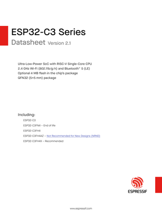
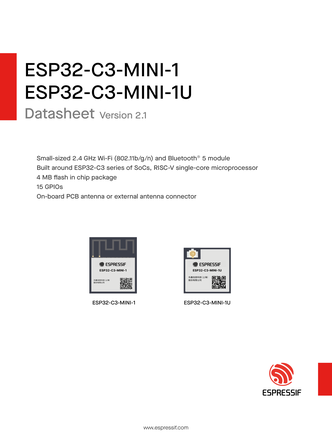
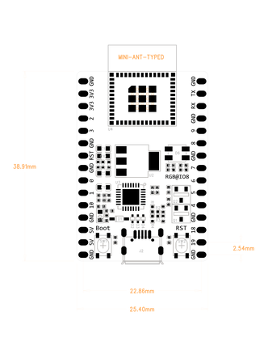
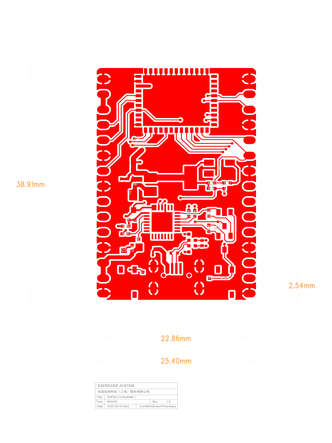
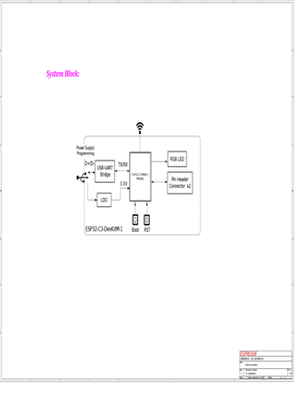

# MicroPython + ST7789 Driver from @russhughes for ESP32 C3


[](https://docs.espressif.com/projects/esp-dev-kits/en/latest/esp32c3/_images/esp32-c3-devkitm-1-v1-pinout.png)

## ESP32-C3 Datasheet:
[](https://www.espressif.com/sites/default/files/documentation/esp32-c3_datasheet_en.pdf)

## ESP32-C3-MINI-1 & ESP32-C3-MINI-1U Datasheet:
[](https://www.espressif.com/sites/default/files/documentation/esp32-c3-mini-1_datasheet_en.pdf)

## ESP32-C3 DevKitM-1 Dimensions:
[](https://dl.espressif.com/dl/schematics/DIMENSION_ESP32-C3-DEVKITM-1_V1_20200915AA.pdf)
- [ESP32-C3 DevKitM-1 Dimensions source file DXF](https://dl.espressif.com/dl/schematics/DIMENSION_ESP32-C3-DEVKITM-1_V1_20200915AA.dxf)

## ESP32-C3 DevKitM-1 PCB Layout:
[](https://dl.espressif.com/dl/schematics/PCB_ESP32-C3-DEVKITM-1_V1_20200915AA.pdf)

## ESP32-C3 DevKitM-1 Schematic:
[](https://dl.espressif.com/dl/schematics/SCH_ESP32-C3-DEVKITM-1_V1_20200915A.pdf)


---

Automated release for MicroPython.

- What we get here:
- ```micropython.bin, bootloader.bin and partition-table.bin plus firmware.bin that is all 3 .bin in just 1 ```
            
## Instructions
            
You need to have some dependencies pre-instaled in your OS:
- Python 3
- Pip
- Python VENV

### Windows or Linux:
Create Virtual Environment
```bash
python -m venv esp-env
```

### On Windows activate Virtual Environment this way:
```bash
.\esp-env\Scripts\activate
```
### On Linux activate Virtual Environment this way:
```bash
source esp-env/bin/activate
```

### On Windows or Linux install esptool:
```bash
pip install esptool
```

### Put ESP32 C3 in BOOTLOADER MODE:
- With USB cable on USB, press BOOT button then RST button, release RST, then release BOOT button. Or unplug, press BOOT button meanwhile you plug in the usb port on PC or SBC like a Raspberry Pi.

- Alternative: Use Thonny IDE, plug your ESP32-C3, on Thonny Shell type:
```bash
from machine import bootloader
```
Press ``Enter`` then type:
```bash
bootloader()
```
Press ``Enter`` then just close Thonny and go to Terminal with Virtual Environment activate.

### Erase Flash:
```bash
python -m esptool --chip esp32c3 erase-flash
```

#### Then Flash:
- Put 3 binaries in the same folder you are executing the steps, example Downloads folder, you need to be in that folder where are the binaries.
```bash
python -m esptool --chip esp32c3 -b 460800 --before default_reset --after hard_reset write_flash --flash_mode dio --flash_size 4MB --flash_freq 80m 0x0 bootloader.bin 0x8000 partition-table.bin 0x10000 micropython.bin
```
- If you use the firmware.bin then:
```bash
python -m esptool --chip esp32c3 --baud 460800 write_flash 0x0 firmware.bin
```

### NOTE IN WINDOWS:
- If you get a PowerShell Scripts Policy Execution Exception that don't let you activate the Virtual Environment:

- Then open a Terminal like Administrator and type:

```bash
Set-ExecutionPolicy Unrestricted
```
- Close the Terminal now you can activate the Python Virtual Enmvironment
