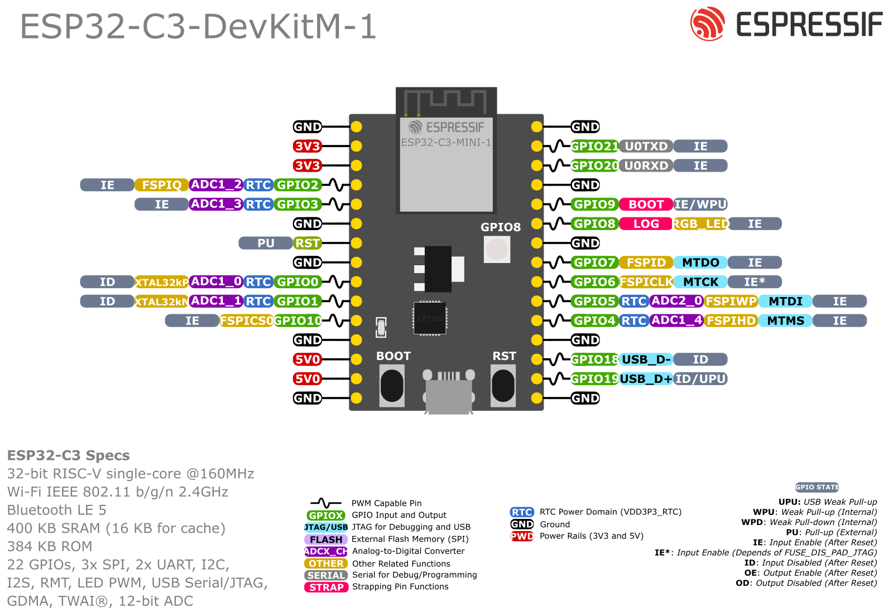

# MicroPython + ST7789 Driver from @russhughes for ESP32 C3

## ESP32-C3 Datasheet:

## ESP32-C3-MINI-1 & ESP32-C3-MINI-1U Datasheet:

## ESP32-C3 DevKitM-1 Dimensions:

- [ESP32-C3 DevKitM-1 Dimensions source file DXF](https://dl.espressif.com/dl/schematics/DIMENSION_ESP32-C3-DEVKITM-1_V1_20200915AA.dxf)

## ESP32-C3 DevKitM-1 PCB Layout:

## ESP32-C3 DevKitM-1 Schematic:

